# 首页配置

首页配置包括 HeaderMenu(菜单栏) 、Banner  、核心能力 、场景案例 、最新消息 、社区信息 、教学视频 、Footer

## HeaderMenu(菜单栏)

```js
// HeaderMenu 
homeConfig.headerMenuConfig = {
  logoText: '1111',
  menuLists: [
    {
      path: "/neverx",
      name: "快速开始",
    },
    {
      isExternal: true,
      path: "https://www.baidu.com/",
      name: "文档",
    },
    {
      path: "/case",
      name: "案例",
      redirect: "/case/xad",
      children: [
        {
          path: "/xad",
          name: "自动驾驶"
        },
        {
          path: "/ss",
          name: "星际争霸"
        },
      ]
    },
    {
      path: "/community",
      id: "community",
      name: "社区",
      isGoAnchor: true
    },
    {
      path: "/teachingVideo",
      id: "teachingVideo",
      name: "教程",
      isGoAnchor: true
    },
  ]
}
```

### headerMenuConfig

| name      | 说明                                                         | 例子             | 图示                                |
| :-------- | :----------------------------------------------------------- | :--------------- | ----------------------------------- |
| logoText  | 菜单上logo字母,需要更改菜单的logo文字直接更改 logoText 中的值 | Oria             |          |
| menuLists | 导航菜单的配置,具体每一项的配置查看下方的 menuItem           | 详情查看上方代码 | 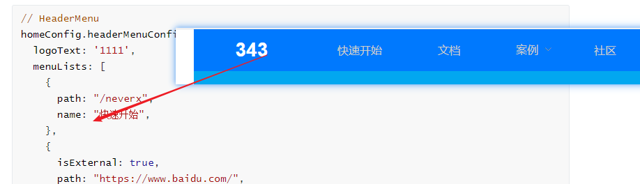 |

#### menuItem

| name       | 说明                                                         | 例子                                            |
| :--------- | :----------------------------------------------------------- | :---------------------------------------------- |
| path       | 切换页面,**除了跳转指定的外部链接地址可修改(同时需要配置isExternal为true)**,系统内部页面切换不能修改 | https://www.baidu.com/ 这为外部链接可以替换更改 |
| name       | 在导航栏中展示的菜单名                                       | 快速开始                                        |
| isExternal | 标记是否为外部链接,需path为外部链接配合使用,否则报错 ,跳转到系统页面的菜单可无需设置此参数 | true                                            |
| children   | 当页面有二级菜单需要配置 ,children中的每一项path和name 解析同上 | 有二级菜单必须配置                              |
| isGoAnchor | 配置是否为锚点定位页面的某一个模块,需要和id的配合一起使用,不可修改,有更改需要可联系开发人员 | true                                            |
| id         | 某一个模块内容的id,和isGoAnchor配合使用定位id的内容配置,id不可修改,有更改需要可联系开发人员 | teachingVideo                                   |

#### 新增menuItem 

新增多一项内容 (只能新增外部地址的菜单,系统内部页面的地址需要开发配置或者使用原来上面代码已存在的地址),在 menuLists 中加多一个 

```js
    {
      isExternal: true,
      path: "https://www.baidu.com/",// 外部跳转地址
      name: "文档", //对应的显示菜单名
    },
    
```


## Banner  

```js
// Banner 
homeConfig.bannerConfig = {
  bannerText: "From research to production？", // 正常
  bannerTextSmall: "NeverX is X-Lab Deep Reinforcement Learning Framework System，……", // 小号
}
```

### bannerConfig

| name            | 说明                                                         | 例子                                                         | 图示                           |
| :-------------- | :----------------------------------------------------------- | ------------------------------------------------------------ | ------------------------------ |
| bannerText      | 定义banner上方中展示的一些大文字,此字号为大字体(48px),若需要替换直接更改bannerText对应的值 | From research to production？                                |       |
| bannerTextSmall | 定义banner上方中展示的一些小文字,此字号为小字体(18px),若需要替换直接更改bannerTextSmall对应的值 | NeverX is X-Lab Deep Reinforcement Learning Framework System，…… |  |


## 核心能力

```js
// 核心能力 
homeConfig.coreAbilityConfig = {
  title: "核心能力",
  coreAbilityLists: [
    {
      title: '特性1',
      desc:
        'Transition seamlessly between eager and graph modes with TorchScript, and accelerate the path to production with TorchServe.',
    },
    {
      title: '特性2',
      desc:
        'Transition seamlessly between eager and graph modes with TorchScript, and accelerate the path to production with TorchServe.',
    },
    {
      title: '特性3',
      desc:
        'Transition seamlessly between eager and graph modes with TorchScript, and accelerate the path to production with TorchServe.',
    },
    {
      title: '特性4',
      desc:
        'Transition seamlessly between eager and graph modes with TorchScript, and accelerate the path to production with TorchServe.',
    },


  ]
}

```

### coreAbilityConfig

| name             | 说明                                                     | 例子           | 图示                             |
| :--------------- | :------------------------------------------------------- | -------------- | -------------------------------- |
| title            | 标题,可更改,直接替换title对应的值                        | 核心能力       |  |
| coreAbilityLists | 核心能力每一项内,具体每一项的说明查看下方coreAbilityItem | 查看上面代码块 |   |

#### coreAbilityItem

| name  | 说明                                               | 例子                                   |
| :---- | :------------------------------------------------- | -------------------------------------- |
| title | 对应每一项的标题,标题,可更改,直接替换title对应的值 |                                        |
| desc  | desc 每一项 内容                                   | Transition seamlessly between eager... |


## 场景案例

```js
// 场景案例 
homeConfig.sceneCaseConfig = {
  title: "场景案例",
  caseLists: [
    {
      imgUrl: './static/images/home/sceneCase/case_image_01.png',
      desc: '星际……'
    },
    {
      imgUrl: './static/images/home/sceneCase/case_image_02.png',
      desc: '自动驾驶……'
    }
  ],

}
```

### sceneCaseConfig

| name      | 说明                                                   | 例子           | 图示                            |
| :-------- | ------------------------------------------------------ | :------------- | ------------------------------- |
| title     | 标题,可更改,直接替换title对应的值                      | 场景案例       | 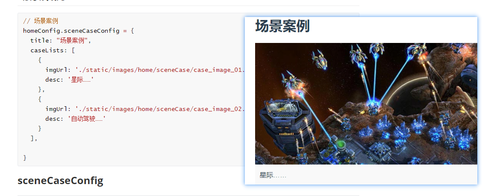 |
| caseLists | 场景的每一项,每一项内,具体每一项的说明查看下方caseItem | 查看上面代码块 | 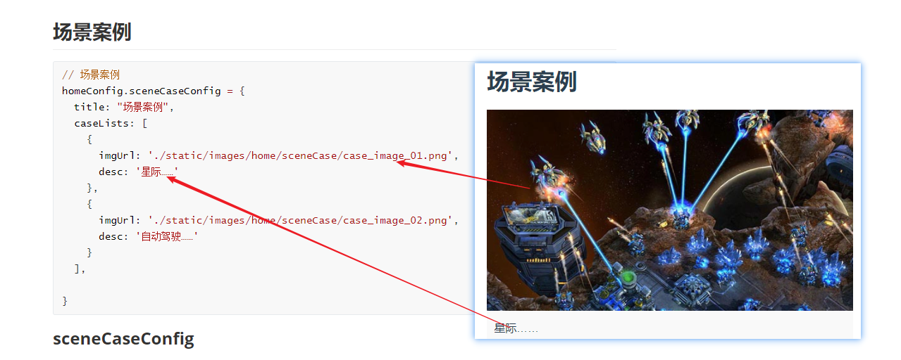   |

#### caseItem

| name   | 说明                 | 例子     | 图示                                                         |
| :----- | -------------------- | :------- | ------------------------------------------------------------ |
| imgUrl | 案例的图片地址       | 场景案例 | 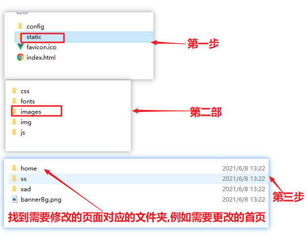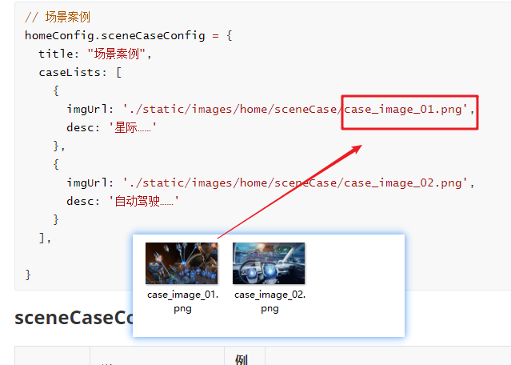 |
| desc   | 案例的描述内容可替换 | 星际……   |                                                              |


## 最新消息 

```js
// 最新消息 
homeConfig.newsConfig = {
  title: "最新消息",
  // 左侧轮播图
  carouselLists: [
    {
      imgUrl: ('./static/images/home/news/news_image_01.png'),
      desc: '星际……'
    },
    {
      imgUrl: ('./static/images/home/news/news_image_02.png'),
      desc: '自动驾驶……'
    },
    {
      imgUrl: ('./static/images/home/news/news_image_03.png'),
      desc: '自动驾驶3……'
    }
  ],
  // 右侧新闻列表
  newLists: [
    {
      content: 'news01',
      time: "20210528"
    },
    {
      content: 'news02',
      time: "20210529"
    },
    {
      content: 'news03',
      time: "20210528"
    },
    {
      content: 'news04',
      time: "20210530"
    },
    {
      content: 'news05',
      time: "20210531"
    },
    {
      content: 'news06',
      time: "20210601"
    },
  ]
}
```

### newsConfig

| name          | 说明                                            | 例子           |
| :------------ | ----------------------------------------------- | :------------- |
| title         | 标题,可更改,直接替换title对应的值               | 最新消息       |
| carouselLists | 新闻轮播图,具体每一项的说明查看下方carouselItem | 查看上面代码块 |
| newsLists     | 新闻列表,具体每一项的说明查看下方newsItem       | 查看上面代码块 |

#### carouselItem

| name   | 说明                                                      | 例子                                                 |
| :----- | --------------------------------------------------------- | :--------------------------------------------------- |
| imgUrl | 轮播图的图片地址,可直接修改对应的图片名 news_image_01.png | require('@/assets/images/home/news/news_image_01.png |
| desc   | 图片说明,可不定义此值                                     | 可不定义此值                                         |

#### newsItem

| name    | 说明           | 例子     |
| :------ | -------------- | :------- |
| content | 新闻内容       | news01   |
| time    | 新闻对应的时间 | 20210528 |


## 社区信息

```js
// 社区信息 
homeConfig.communityConfig = {
  title: "社区信息",
  communityLists: [
    {
      title: '技术沙龙',
      desc:
        '对游戏玩家来说，无论是团队FPS、MOBA竞技还是生存类游戏，稳定、低延迟是获胜的关键。',
      link: 'https://www.baidu.com',
      linkText: '查看详情'
    },
    {
      title: 'GitHub社区',
      desc:
        '对游戏玩家来说，无论是团队FPS、MOBA竞技还是生存类游戏，稳定、低延迟是获胜的关键。',
      link: 'https://www.baidu.com',
      linkText: '查看详情'

    },
    {
      title: '比赛……',
      desc:
        '对游戏玩家来说，无论是团队FPS、MOBA竞技还是生存类游戏，稳定、低延迟是获胜的关键。',
      link: 'https://www.baidu.com',
      linkText: '查看详情'

    }
  ]
}
```

### communityConfig

| name           | 说明                                                       | 例子           |
| :------------- | ---------------------------------------------------------- | :------------- |
| title          | 标题,可更改,直接替换title对应的值                          | 社区信息       |
| communityLists | 社区信息每一项的内容,具体每一项的说明查看下方communityItem | 查看上面代码块 |

#### communityItem

| name     | 说明                                     | 例子                                                         |
| :------- | ---------------------------------------- | :----------------------------------------------------------- |
| title    | 标题,可更改,直接替换title对应的值        | 技术沙龙                                                     |
| desc     | 对应的社区信息的描述                     | 对游戏玩家来说，无论是团队FPS、MOBA竞技还是生存类游戏，稳定、低延迟是获胜的关键。 |
| link     | 点击查看详情(linkText对应的值)跳转的链接 | link: 'https://www.baidu.com',                               |
| linkText | 链接连接的显示文字                       | 查看详情                                                     |


## 教学视频

```js
// 教学视频 
homeConfig.teachingVideoConfig = {
  title: "教学视频",
  teachingVideoLists: [
    {
      videoLink: 'https://www.baidu.com',
    },
    {

      videoLink: 'https://map.baidu.com/@12688783,2562483,13z',
    },
    {
      videoLink: 'https://www.baidu.com',
    }
  ]
}

```

### teachingVideoConfig

| name               | 说明                                                | 例子           |
| :----------------- | --------------------------------------------------- | :------------- |
| title              | 标题,可更改,直接替换title对应的值                   | 教学视频       |
| teachingVideoLists | 每一项的视频内容,videoLink 对应的每一项的视频的链接 | 查看上面代码块 |


## Footer

```js
// Footer 
export const footerConfig = {
  footerInfoLists: [
    {
      title: '相关资源',
      items: [
        {
          itemTitle: '文档',
          link: 'https://www.baidu.com/'
        },
        {
          itemTitle: '教程',
          link: 'https://www.baidu.com/'
        },
        {
          itemTitle: '示例项目',
          link: 'https://www.baidu.com/'
        }
      ]
    },
    {
      title: '友情链接',
      items: [
        {
          itemTitle: '商汤科技01',
          link: 'https://www.baidu.com/'
        },
        {
          itemTitle: '友情链接01',
          link: 'https://www.baidu.com/'
        },
        {
          itemTitle: '友情链接02',
          link: 'https://www.baidu.com/'
        }
      ]
    },
    {
      title: '联系我们',
      items: [
        {
          itemTitle: '源码',
          link: 'https://www.baidu.com/'
        },
        {
          itemTitle: '邮箱',
          link: 'https://www.baidu.com/'
        },
        {
          itemTitle: '联系我们01',
          link: 'https://www.baidu.com/'
        }
      ]
    }
  ],
  qrcodeLists: [
    {
      imgUrl: require('@/assets/images/home/footer/qrcode_image_01.png')
    },
    {
      imgUrl: require('@/assets/images/home/footer/qrcode_image_02.png')
    }
  ]
}
```

### footerConfig

| name            | 说明                                                         | 例子                           |
| :-------------- | ------------------------------------------------------------ | :----------------------------- |
| footerInfoLists | 脚部左侧的信息配置,具体每一项的配置说明查看下方footerInfoItem | 查看上面代码块,footerInfoLists |
| qrcodeLists     | 脚部右侧的二维码,具体每一项的配置说明查看下方qrcodeItem      | 查看上面代码块,qrcodeLists     |

#### footerInfoItem

| name  | 说明                                 | 例子                                             |
| :---- | ------------------------------------ | :----------------------------------------------- |
| title | 标题,可更改,直接替换title对应的值    | 相关资源                                         |
| items | title对应的一些信息,如itemTitle,link | itemTitle: '文档',link: 'https://www.baidu.com/' |

#### qrcodeItem

| name   | 说明                                              | 例子                                                         |
| :----- | ------------------------------------------------- | :----------------------------------------------------------- |
| imgUrl | 二维码对应的图片地址,可直接修改对应的二维码图片名 | imgUrl: require('@/assets/images/home/footer/qrcode_image_01.png') |


# Neverx配置

## HeaderMenu(菜单栏)

```js
// HeaderMenu 
neverxConfig.headerMenuConfig = {
  logoText: 'Neverx',
  menuLists: [{
      path: "/neverxInstallInfo",
      name: "安装",
      id: "neverxInstallInfo",
      isGoAnchor: true
    },
    {
      isExternal: true,
      path: "https://www.baidu.com/",
      name: "文档",
    },
    {
      id: "neverxSourceCode",
      name: "源码",
      isExternal: true,
      path: "https://www.baidu.com/",

    },

  ]
}
```

### headerMenuConfig

| name      | 说明                                                         | 例子             | 图示                                |
| :-------- | :----------------------------------------------------------- | :--------------- | ----------------------------------- |
| logoText  | 菜单上logo字母,需要更改菜单的logo文字直接更改 logoText 中的值 | Neverx           | 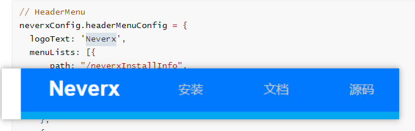     |
| menuLists | 导航菜单的配置,具体每一项的配置查看下方的 menuItem           | 详情查看上方代码 |  |

#### menuItem

| name       | 说明                                                         | 例子                                            |
| :--------- | :----------------------------------------------------------- | :---------------------------------------------- |
| path       | 切换页面,**除了跳转指定的外部链接地址可修改(同时需要配置isExternal为true)**,系统内部页面切换不能修改 | https://www.baidu.com/ 这为外部链接可以替换更改 |
| name       | 在导航栏中展示的菜单名                                       | 快速开始                                        |
| isExternal | 标记是否为外部链接,需path为外部链接配合使用,否则报错 ,跳转到系统页面的菜单可无需设置此参数 | true                                            |
| children   | 当页面有二级菜单需要配置 ,children中的每一项path和name 解析同上 | 有二级菜单必须配置                              |
| isGoAnchor | 配置是否为锚点定位页面的某一个模块,需要和id的配合一起使用,不可修改,有更改需要可联系开发人员 | true                                            |
| id         | 某一个模块内容的id,和isGoAnchor配合使用定位id的内容配置,id不可修改,有更改需要可联系开发人员 | teachingVideo                                   |

#### 新增menuItem 

新增多一项内容 (只能新增外部地址的菜单,系统内部页面的地址需要开发配置或者使用原来上面代码已存在的地址),在 menuLists 中加多一个 

```js
    {
      isExternal: true,
      path: "https://www.baidu.com/",// 外部跳转地址
      name: "文档", //对应的显示菜单名
    },
    ]
```


## Banner  

```js
// Banner 
neverxConfig.bannerConfig = {
  bannerTextSmall: "NeverX is X-Lab Deep Reinforcement Learning Framework System，you can ……", // 小号
}
```

### bannerConfig

| name            | 说明                                                         | 例子                                                         | 图示                                  |
| :-------------- | :----------------------------------------------------------- | ------------------------------------------------------------ | ------------------------------------- |
| bannerTextSmall | 定义banner上方中展示的一些小文字,此字号为小字体(18px),若需要替换直接更改bannerTextSmall对应的值 | NeverX is X-Lab Deep Reinforcement Learning Framework System，you can …… |  |


## InstallInfo(安装)

```js
// 安装
neverxConfig.installInfoConfig = {
  title: '安装',
  formConfig: [{
      label: 'Version',
      type: 'radioGroup',
      value: "",
      radioList: [{
          label: '0.1',
          value: '0.1'
        },
        {
          label: '0.2',
          value: '0.2'
        },
        {
          label: '0.3',
          value: '0.3'
        },
        {
          label: '0.4',
          value: '0.4'
        }
      ]
    },
    {
      label: 'OS',
      type: 'radioGroup',
      radioList: [{
          label: 'Linux',
          value: 'Linux'
        },
        {
          label: 'Windows',
          value: 'Windows'
        },
        {
          label: 'MacOS',
          value: 'MacOS'
        }
      ]
    },
    {
      label: 'Package',
      type: 'radioGroup',
      radioList: [{
          label: 'Pip',
          value: 'Pip'
        },
        {
          label: 'Source',
          value: 'Source'
        }
      ]
    },
    {
      label: 'Run this Cmd',
      type: 'cmd',
      value: `git clone http://gitlab.bj.sensetime.com/open-XLab/cell/nerveX.git cd
    nerveX source r0.3.2 pip install . --user pip install -e . --userf`
    }
  ],
  valueObj: {
    radio0: '0.1',
    radio1: 'Linux',
    radio2: 'Pip'
  },
  cmdObj: {
    "0.1LinuxPip": "git clone http://gitlab.bj.sensetime.com/open-XLab/cell/nerveX.git cd nerveX source r0.3.2 pip install . --user pip install -e . --userf",
    "0.1LinuxSource": "0.1LinuxSource",
    "0.1WindowsPip": "0.1WindowsPip",
    "0.1WindowsSource": "0.1WindowsSource",
    "0.1MacOSPip": "0.1MacOSPip",
    "0.1MacOSSource": "0.1MacOSSource",

    "0.2LinuxPip": "0.2LinuxPip",
    "0.2LinuxSource": "0.2LinuxSource",
    "0.2WindowsPip": "0.2WindowsPip",
    "0.2WindowsSource": "0.2WindowsSource",
    "0.2MacOSPip": "0.2MacOSPip",
    "0.2MacOSSource": "0.2MacOSSource",

    "0.3LinuxPip": "0.3LinuxPip",
    "0.3LinuxSource": "0.3LinuxSource",
    "0.3WindowsPip": "0.3WindowsPip",
    "0.3WindowsSource": "0.3WindowsSource",
    "0.3MacOSPip": "0.3MacOSPip",
    "0.3MacOSSource": "0.3MacOSSource",

    "0.4LinuxPip": "0.4LinuxPip",
    "0.4LinuxSource": "0.4LinuxSource",
    "0.4WindowsPip": "0.4WindowsPip",
    "0.4WindowsSource": "0.4WindowsSource",
    "0.4MacOSPip": "0.4MacOSPip",
    "0.4MacOSSource": "0.4MacOSSource",
  }

}
```

### installInfoConfig

| name       | 说明                                 | 例子                            |
| :--------- | :----------------------------------- | :------------------------------ |
| title      | 标题,可更改,直接替换title对应的值    | 安装                            |
| formConfig | VersionradioGroupPackage             | 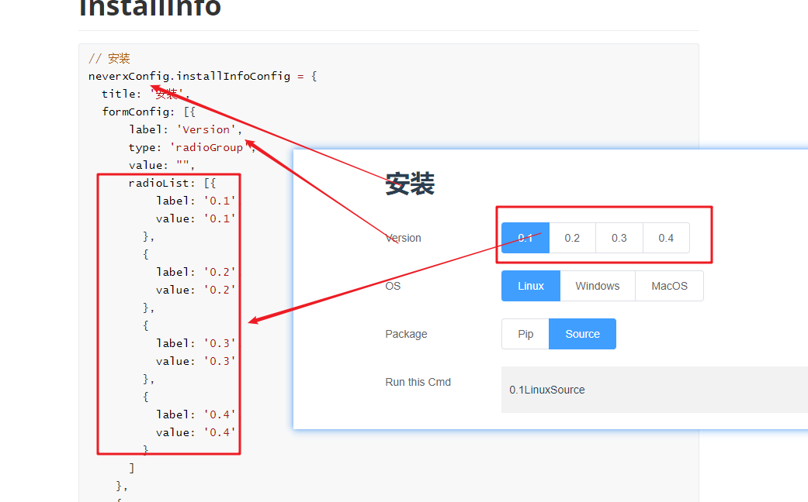 |
| valueObj   | 默认选中的组合                       | 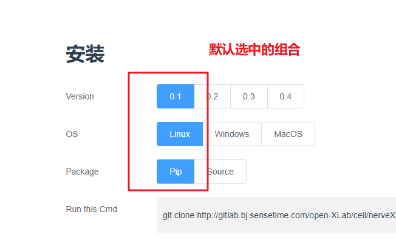    |
| cmdObj     | 上面选择的组合对应的命令输出的值配置 | 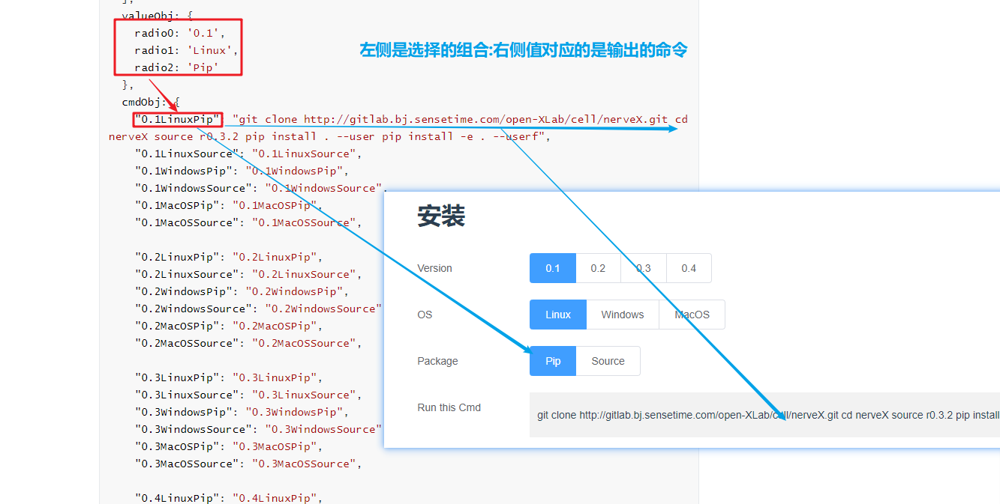        |

DocumentInfo(文档)

```js
// 文档
neverxConfig.documentInfoConfig = {
  title: "文档",
  content: "open-xlab.pages.gitlab.bj.sensetime.com/cell/nerveX/guide/index.html"
}
```

### documentInfoConfig

| name    | 说明                              | 例子                       |
| :------ | :-------------------------------- | :------------------------- |
| title   | 标题,可更改,直接替换title对应的值 | 文档                       |
| content |                                   | 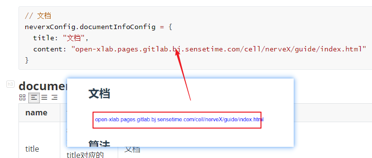 |


## 算法

配置详情和文档配置一致


#  SS配置

## HeaderMenu(菜单栏)

```js
// HeaderMenu 
 ssConfig.headerMenuConfig = {
  logoText: 'ss',
  menuLists: [
    {
      path: "/ssInstallInfo",
      name: "安装",
      id: "ssInstallInfo",
      isGoAnchor: true
    },
    {
      path: "/ssDocumentInfo",
      name: "文档",
      id: "ssDocumentInfo",
      isGoAnchor: true
    },
    {
      path: "/ssDataInfo",
      name: "数据",
      id: "ssDataInfo",
      isGoAnchor: true
    },

    {
      id: "ssSourceCode",
      name: "源码",
      isExternal:true,
      path: "https://www.baidu.com/",
    },

  ]
}

```

### headerMenuConfig

| name      | 说明                                                         | 例子             | 图示                                |
| :-------- | :----------------------------------------------------------- | :--------------- | ----------------------------------- |
| logoText  | 菜单上logo字母,需要更改菜单的logo文字直接更改 logoText 中的值 | XAD              | 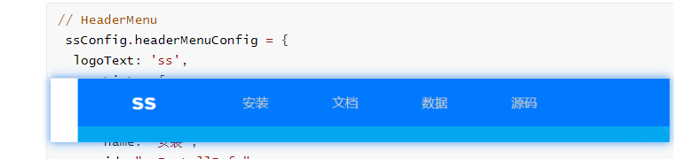         |
| menuLists | 导航菜单的配置,具体每一项的配置查看下方的 menuItem           | 详情查看上方代码 |  |

#### menuItem2

| name       | 说明                                                         | 例子                                            |
| :--------- | :----------------------------------------------------------- | :---------------------------------------------- |
| path       | 切换页面,**除了跳转指定的外部链接地址可修改(同时需要配置isExternal为true)**,系统内部页面切换不能修改 | https://www.baidu.com/ 这为外部链接可以替换更改 |
| name       | 在导航栏中展示的菜单名                                       | 快速开始                                        |
| isExternal | 标记是否为外部链接,需path为外部链接配合使用,否则报错 ,跳转到系统页面的菜单可无需设置此参数 | true                                            |
| children   | 当页面有二级菜单需要配置 ,children中的每一项path和name 解析同上 | 有二级菜单必须配置                              |
| isGoAnchor | 配置是否为锚点定位页面的某一个模块,需要和id的配合一起使用,不可修改,有更改需要可联系开发人员 | true                                            |
| id         | 某一个模块内容的id,和isGoAnchor配合使用定位id的内容配置,id不可修改,有更改需要可联系开发人员 | documentInfo                                    |

#### 新增menuItem 

新增多一项内容 (只能新增外部地址的菜单,系统内部页面的地址需要开发配置或者使用原来上面代码已存在的地址),在 menuLists 中加多一个 

```js
    {
      isExternal: true,
      path: "https://www.baidu.com/",// 外部跳转地址
      name: "文档", //对应的显示菜单名
    },
    ]
```

## Banner  

```js
// Banner 
 ssConfig.bannerConfig = {
  bannerText: "SS", // 正常
  bannerTextSmall: "SS is X-Lab Deep Reinforcement Learning《星际争霸2》是一款RTS（即时战略）游戏，说白了就是造农民采矿、造建筑、造兵、攀科技，最后派兵拆光对手的建筑 System", // 小号
}
```

### bannerConfig

| name            | 说明                                                         | 例子                                                         | 图示                        |
| :-------------- | :----------------------------------------------------------- | ------------------------------------------------------------ | --------------------------- |
| bannerText      | 定义banner上方中展示的一些大文字,此字号为大字体(48px),若需要替换直接更改bannerText对应的值 | SS                                                           |  |
| bannerTextSmall | 定义banner上方中展示的一些小文字,此字号为小字体(18px),若需要替换直接更改bannerTextSmall对应的值 | SS is X-Lab Deep Reinforcement Learning《星际争霸2》是一款RTS（即时战略）游戏，说白了就是造农民采矿、造建筑、造兵、攀科技，最后派兵拆光对手的建筑 System |  |


## InstallInfo(安装)

```js
// 安装
 ssConfig.installInfoConfig = {
  title: '安装',

  formConfig: [
    {
      label: 'Version',
      type: 'radioGroup',
      radioList: [
        {
          label: '0.1',
          value: '0.1'
        },
        {
          label: '0.2',
          value: '0.2'
        },
        {
          label: '0.3',
          value: '0.3'
        },
        {
          label: '0.4',
          value: '0.4'
        }
      ]
    },
    {
      label: 'OS',
      type: 'radioGroup',
      radioList: [
        {
          label: 'Linux',
          value: 'Linux'
        },
        {
          label: 'Windows',
          value: 'Windows'
        },
        {
          label: 'MacOS',
          value: 'MacOS'
        }
      ]
    },
    {
      label: 'Package',
      type: 'radioGroup',
      radioList: [
        {
          label: 'Pip',
          value: 'Pip'
        },
        {
          label: 'Source',
          value: 'Source'
        }
      ]
    },
    {
      label: 'Run this Cmd',
      type: 'cmd',
      value: `git clone http://gitlab.bj.sensetime.com/open-XLab/cell/nerveX.git cd
    nerveX source r0.3.2 pip install . --user pip install -e . --userf`
    }
  ],
  valueObj: { 
    radio0: '0.1',
    radio1: 'Linux',
    radio2: 'Pip'
  },
  cmdObj:{
    "0.1LinuxPip":"git clone http://gitlab.bj.sensetime.com/open-XLab/cell/nerveX.git cd nerveX source r0.3.2 pip install . --user pip install -e . --userf",
    "0.1LinuxSource":"0.1LinuxSource",
    "0.1WindowsPip":"0.1WindowsPip",
    "0.1WindowsSource":"0.1WindowsSource",
    "0.1MacOSPip":"0.1MacOSPip",
    "0.1MacOSSource":"0.1MacOSSource",

    "0.2LinuxPip":"0.2LinuxPip",
    "0.2LinuxSource":"0.2LinuxSource",
    "0.2WindowsPip":"0.2WindowsPip",
    "0.2WindowsSource":"0.2WindowsSource",
    "0.2MacOSPip":"0.2MacOSPip",
    "0.2MacOSSource":"0.2MacOSSource",

    "0.3LinuxPip":"0.3LinuxPip",
    "0.3LinuxSource":"0.3LinuxSource",
    "0.3WindowsPip":"0.3WindowsPip",
    "0.3WindowsSource":"0.3WindowsSource",
    "0.3MacOSPip":"0.3MacOSPip",
    "0.3MacOSSource":"0.3MacOSSource",

    "0.4LinuxPip":"0.4LinuxPip",
    "0.4LinuxSource":"0.4LinuxSource",
    "0.4WindowsPip":"0.4WindowsPip",
    "0.4WindowsSource":"0.4WindowsSource",
    "0.4MacOSPip":"0.4MacOSPip",
    "0.4MacOSSource":"0.4MacOSSource",
  },
  exampleInfo: {
    title: "示例",
    caseLists: [
      {
      title: "SL训练示例",
      content: "tag"
    },
      {
      title: "SL训练示例",
      content: "tag"
    },
      {
      title: "人机对战示例",
      content: "文本标签"
    },
  ]

  }
}
```

### installInfoConfig

| name        | 说明                                 | 图示                            |
| :---------- | :----------------------------------- | :------------------------------ |
| title       | 标题,可更改,直接替换title对应的值    | 安装                            |
| formConfig  | VersionradioGroupPackage             |  |
| valueObj    | 默认选中的组合                       |     |
| cmdObj      | 上面选择的组合对应的命令输出的值配置 |         |
| exampleInfo | 示例                                 | 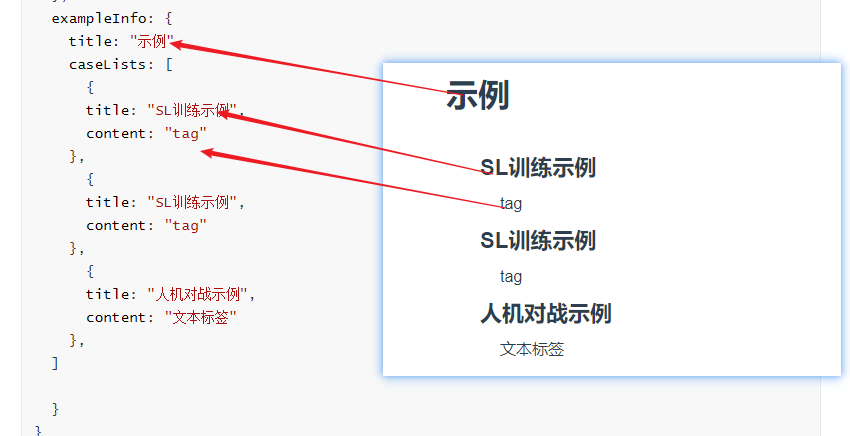         |

## DocumentInfo(文档)

```js
// 文档
 ssConfig.documentInfoConfig = {
  title: "文档",
  content: "open-xlab.pages.gitlab.bj.sensetime.com/cell/nerveX/guide/index.html"
}

```

### documentInfoConfig

| name    | 说明                              | 图示                       |
| :------ | :-------------------------------- | :------------------------- |
| title   | 标题,可更改,直接替换title对应的值 | 文档                       |
| content |                                   |  |


## dataInfo

```js
// 数据 dataDetail: 数据详情介绍  dataFormat:数据格式 dataBenchmark:数据评测  dataDownload:数据下载
 ssConfig.dataInfoConfig = {
  title: "数据",
  replay: {
    title: "replay",
    content: "Lorem ipsum dolor sit amet, consectetur adipisicing elit. Placeat sunt repudiandae earum animi itaque voluptatibus blanditiis! Quasi enim dolor vero consequatur consectetur. Vitae quia omnis natus voluptatem ratione dolor eaque.",
  },
  model: {
    title: "model",
    content: "Lorem ipsum dolor sit ame",

  },
  video: {
    title: "视频",
    videoLink: '//vjs.zencdn.net/v/oceans.mp4',
    vedeoImg: './static/images/ss/video/video_image_01.png', //视频展示的封面
  },

}

```


### dataInfoConfig

| name   | 说明                              | 图示                          |
| :----- | :-------------------------------- | :---------------------------- |
| title  | 标题,可更改,直接替换title对应的值 | 文数据                        |
| replay | replay详情介绍                    | 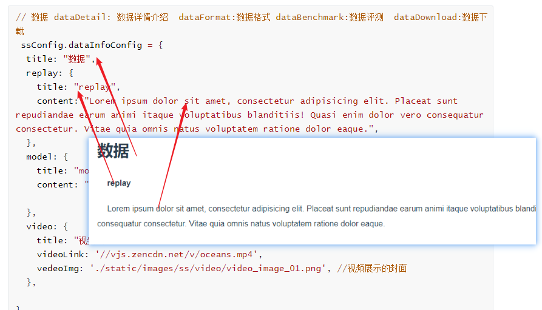 |
| model  | model详情介绍                     |    |
| video  | video配置                         | 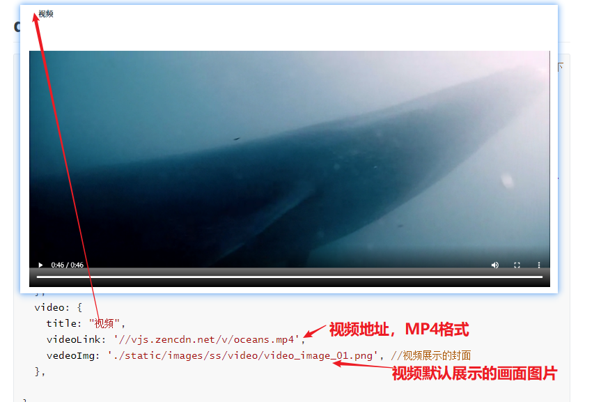     |


#  Xad配置

## HeaderMenu(菜单栏)

```js
// HeaderMenu 
 xadConfig.headerMenuConfig = {
  logoText: 'XAD',
  menuLists: [
    {
      path: "/installInfo",
      name: "安装",
      id: "installInfo",
      isGoAnchor: true
    },
    {
      path: "/documentInfo",
      name: "文档",
      id: "documentInfo",
      isGoAnchor: true
    },
    {
      path: "/dataInfo",
      name: "数据",
      id: "dataInfo",
      isGoAnchor: true
    },

    {
      id: "sourceCode",
      name: "源码",
      isExternal:true,
      path: "https://www.baidu.com/",
    },

  ]
}
```

### headerMenuConfig

| name      | 说明                                                         | 例子             | 图示                                |
| :-------- | :----------------------------------------------------------- | :--------------- | ----------------------------------- |
| logoText  | 菜单上logo字母,需要更改菜单的logo文字直接更改 logoText 中的值 | XAD              | 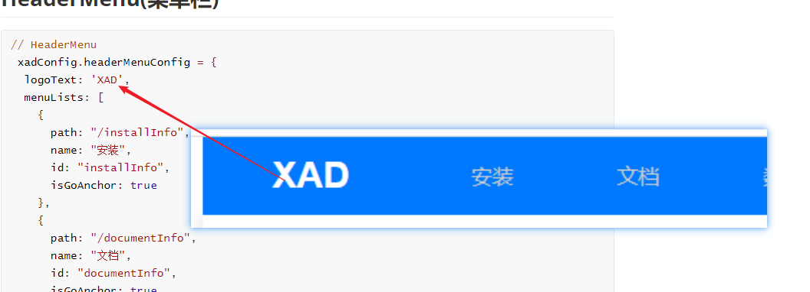        |
| menuLists | 导航菜单的配置,具体每一项的配置查看下方的 menuItem           | 详情查看上方代码 |  |

#### menuItem

| name       | 说明                                                         | 例子                                            |
| :--------- | :----------------------------------------------------------- | :---------------------------------------------- |
| path       | 切换页面,**除了跳转指定的外部链接地址可修改(同时需要配置isExternal为true)**,系统内部页面切换不能修改 | https://www.baidu.com/ 这为外部链接可以替换更改 |
| name       | 在导航栏中展示的菜单名                                       | 快速开始                                        |
| isExternal | 标记是否为外部链接,需path为外部链接配合使用,否则报错 ,跳转到系统页面的菜单可无需设置此参数 | true                                            |
| children   | 当页面有二级菜单需要配置 ,children中的每一项path和name 解析同上 | 有二级菜单必须配置                              |
| isGoAnchor | 配置是否为锚点定位页面的某一个模块,需要和id的配合一起使用,不可修改,有更改需要可联系开发人员 | true                                            |
| id         | 某一个模块内容的id,和isGoAnchor配合使用定位id的内容配置,id不可修改,有更改需要可联系开发人员 | documentInfo                                    |

#### 新增menuItem 

新增多一项内容 (只能新增外部地址的菜单,系统内部页面的地址需要开发配置或者使用原来上面代码已存在的地址),在 menuLists 中加多一个 

```js
    {
      isExternal: true,
      path: "https://www.baidu.com/",// 外部跳转地址
      name: "文档", //对应的显示菜单名
    },
    ]
```


## InstallInfo(安装)

```js
// 安装
 xadConfig.installInfoConfig = {
  title: '安装',

  formConfig: [
    {
      label: 'Version',
      type: 'radioGroup',
      radioList: [
        {
          label: '0.1',
          value: '0.1'
        },
        {
          label: '0.2',
          value: '0.2'
        },
        {
          label: '0.3',
          value: '0.3'
        },
        {
          label: '0.4',
          value: '0.4'
        }
      ]
    },
    {
      label: 'OS',
      type: 'radioGroup',
      radioList: [
        {
          label: 'Linux',
          value: 'Linux'
        },
        {
          label: 'Windows',
          value: 'Windows'
        },
        {
          label: 'MacOS',
          value: 'MacOS'
        }
      ]
    },
    {
      label: 'Package',
      type: 'radioGroup',
      radioList: [
        {
          label: 'Pip',
          value: 'Pip'
        },
        {
          label: 'Source',
          value: 'Source'
        }
      ]
    },
    {
      label: 'Run this Cmd',
      type: 'cmd',
      value: `git clone http://gitlab.bj.sensetime.com/open-XLab/cell/nerveX.git cd
    nerveX source r0.3.2 pip install . --user pip install -e . --userf`
    }
  ],
  valueObj: { 
    radio0: '0.1',
    radio1: 'Linux',
    radio2: 'Pip'
  },
  cmdObj:{
    "0.1LinuxPip":"git clone http://gitlab.bj.sensetime.com/open-XLab/cell/nerveX.git cd nerveX source r0.3.2 pip install . --user pip install -e . --userf",
    "0.1LinuxSource":"0.1LinuxSource",
    "0.1WindowsPip":"0.1WindowsPip",
    "0.1WindowsSource":"0.1WindowsSource",
    "0.1MacOSPip":"0.1MacOSPip",
    "0.1MacOSSource":"0.1MacOSSource",

    "0.2LinuxPip":"0.2LinuxPip",
    "0.2LinuxSource":"0.2LinuxSource",
    "0.2WindowsPip":"0.2WindowsPip",
    "0.2WindowsSource":"0.2WindowsSource",
    "0.2MacOSPip":"0.2MacOSPip",
    "0.2MacOSSource":"0.2MacOSSource",

    "0.3LinuxPip":"0.3LinuxPip",
    "0.3LinuxSource":"0.3LinuxSource",
    "0.3WindowsPip":"0.3WindowsPip",
    "0.3WindowsSource":"0.3WindowsSource",
    "0.3MacOSPip":"0.3MacOSPip",
    "0.3MacOSSource":"0.3MacOSSource",

    "0.4LinuxPip":"0.4LinuxPip",
    "0.4LinuxSource":"0.4LinuxSource",
    "0.4WindowsPip":"0.4WindowsPip",
    "0.4WindowsSource":"0.4WindowsSource",
    "0.4MacOSPip":"0.4MacOSPip",
    "0.4MacOSSource":"0.4MacOSSource",
  },
}
```

### installInfoConfig

| name       | 说明                                 | 图示                            |
| :--------- | :----------------------------------- | :------------------------------ |
| title      | 标题,可更改,直接替换title对应的值    | 安装                            |
| formConfig | VersionradioGroupPackage             |  |
| valueObj   | 默认选中的组合                       |     |
| cmdObj     | 上面选择的组合对应的命令输出的值配置 |         |

## DocumentInfo(文档)

```js
// 文档
 xadConfig.documentInfoConfig = {
  title: "文档",
  content: "open-xlab.pages.gitlab.bj.sensetime.com/cell/nerveX/guide/index.html"
}

```

### documentInfoConfig

| name    | 说明                              | 图示                       |
| :------ | :-------------------------------- | :------------------------- |
| title   | 标题,可更改,直接替换title对应的值 | 文档                       |
| content |                                   |  |


## dataInfo

```js
// 数据 dataDetail: 数据详情介绍  dataFormat:数据格式 dataBenchmark:数据评测  dataDownload:数据下载
 xadConfig.dataInfoConfig = {
  title: "数据",
  dataDetail: {
    title: "数据详情介绍",
    content: "Lorem ipsum dolor sit amet, consectetur adipisicing elit. Placeat sunt repudiandae earum animi itaque voluptatibus blanditiis! Quasi enim dolor vero consequatur consectetur. Vitae quia omnis natus voluptatem ratione dolor eaque.",
    // 需要展示的数据
    tableData: [
      {
        name: '路口前障碍物停车测试',
        picture: './static/images/xad/dataInfo/data_image_01.png',
        desc: 'test test',
      },
      {
        name: '路口中不overtake测试',
        picture: ('./static/images/xad/dataInfo/data_image_02.png'),
        desc: '路口中不overtake测试',
      },
    ],
    // 行列配置
    columns: [
      {
        prop: "name",
        label: "样例名称",
        width: "180",
      },
      {
        prop: "picture",
        label: "示例图片",
        width: "300",
        isPicture: true
      },
      {
        prop: "desc",
        label: "描述",
        width: "180",
      },
      {
        prop: "download",
        label: "下载",
        width: "180",
      },
    ]
  },

  dataFormat: {
    title: "数据格式",
    content: "Lorem ipsum dolor sit ame",

  },
  dataBenchmark: {
    title: "数据评测",
    // 需要展示的数据
    tableData: [
      {
        models: 'CLIS',
        successRate: '24%',
        noCrashRate: '24%',
      },
      {
        models: 'MME2E ef',
        successRate: '24%',
        noCrashRate: '24%',
      },
      {
        models: 'LBC',
        successRate: '24%',
        noCrashRate: '24%',
      },
    ],
    // 行列配置
    columns: [
      {
        prop: "models",
        label: "Models",
        width: "180",
      },
      {
        prop: "successRate",
        label: "Success Rate",
        width: "300",
      },
      {
        prop: "noCrashRate",
        label: "No crash rate",
        width: "180",
      },

    ]
  },

  dataDownload: {
    title: '数据下载',
    content: [
      {
        name: "downloadtest01.zip",
        link: "",  //此处需要填写实际需要下载的地址
      },
      {
        name: "downloadtest02.zip",
        link: "",  //此处需要填写实际需要下载的地址
      },
      {
        name: "downloadtest03.zip",
        link: "",  //此处需要填写实际需要下载的地址
      },
    ]
  }


}

```


### dataInfoConfig

| name          | 说明                                                 | 图示                             |
| :------------ | :--------------------------------------------------- | :------------------------------- |
| title         | 标题,可更改,直接替换title对应的值                    | 文数据                           |
| dataDetail    | 数据详情介绍,具体配置看下方dataDetailConfig          | 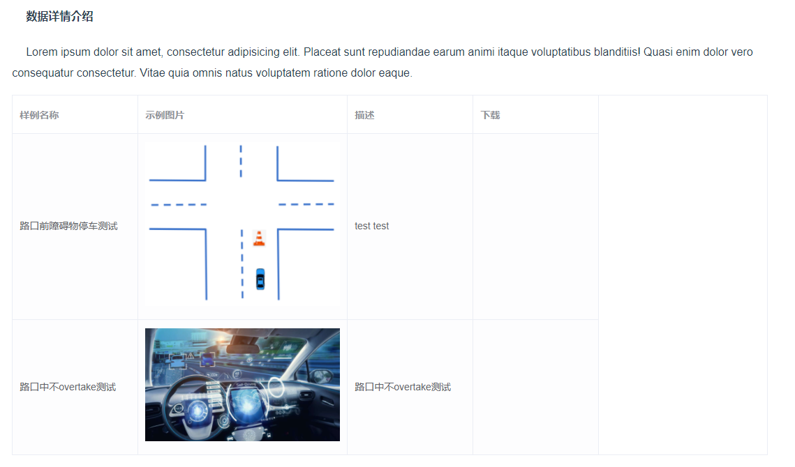   |
| dataFormat    | title为标题直接可修改，content为对应的内容，可以修改 | 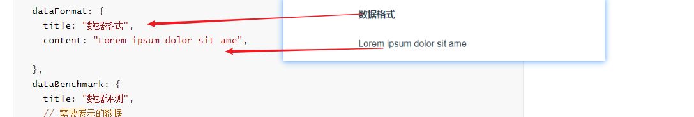       |
| dataBenchmark | 数据评测配置，具体详情说明如 dataDetail              | 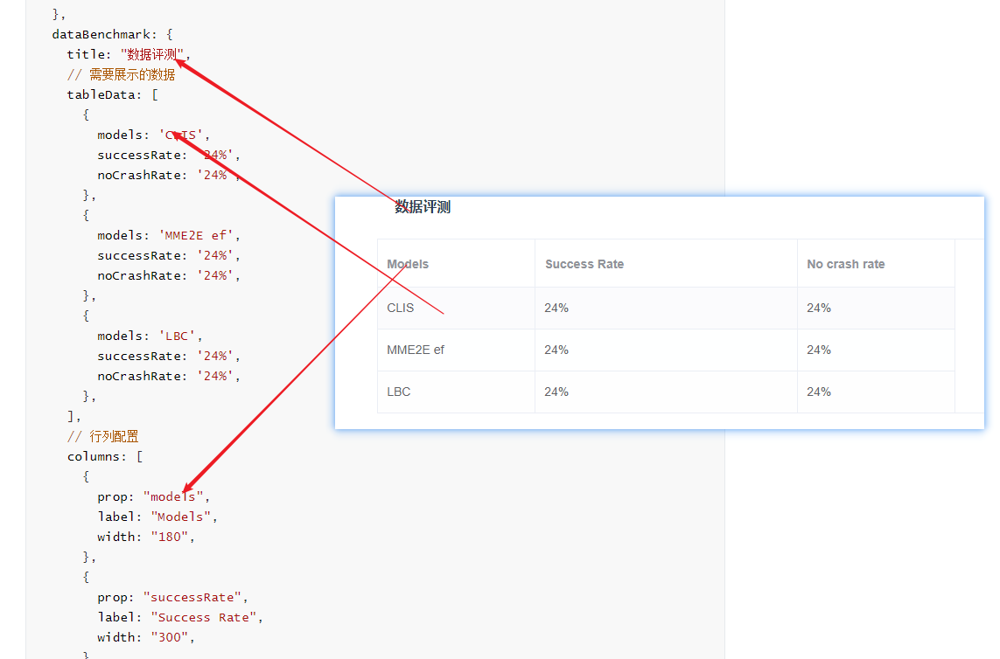        |
| dataDownload  | 数据下载配置                                         | 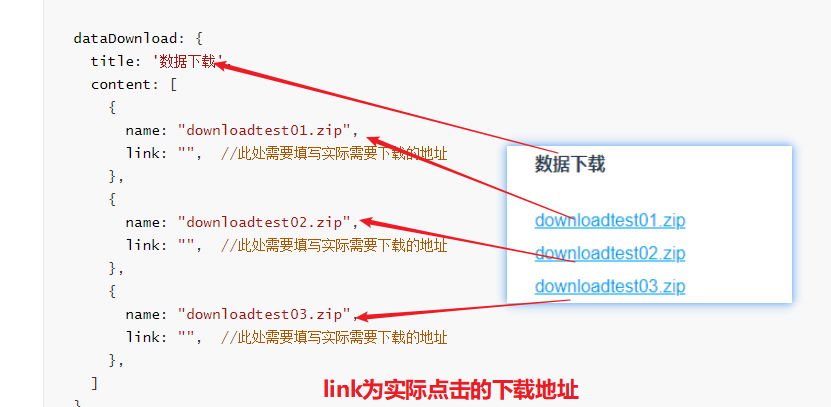 |


#### dataDetailConfig

| name      | 说明                              | 图示                          |
| :-------- | :-------------------------------- | :---------------------------- |
| title     | 标题,可更改,直接替换title对应的值 | 文数据                        |
| content   | 数据详情介绍                      | 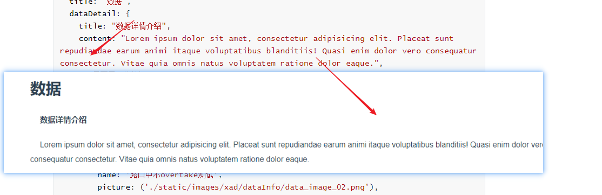 |
| tableData | 数据详情表格的配置                | 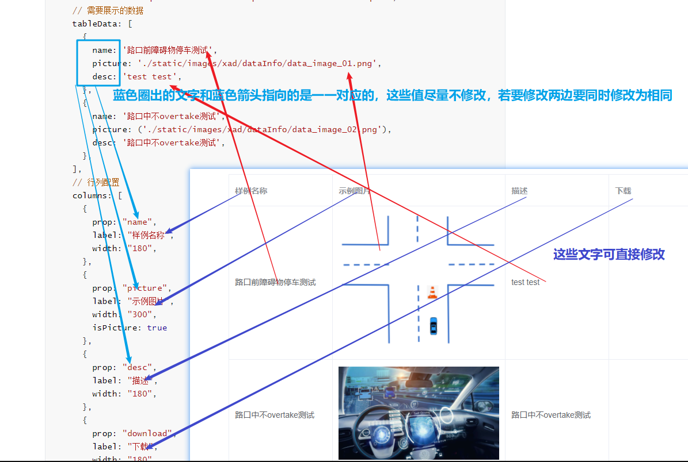     |
| columns   | 对应表格种的每一列的配置          | 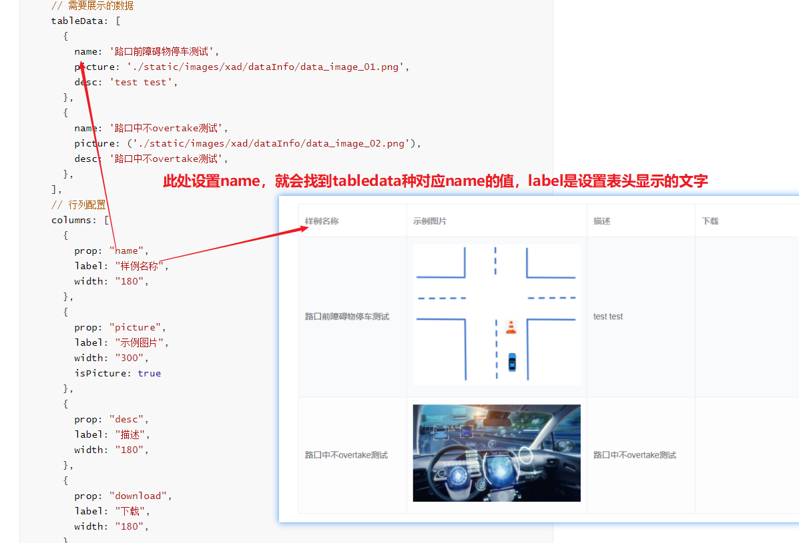   |


